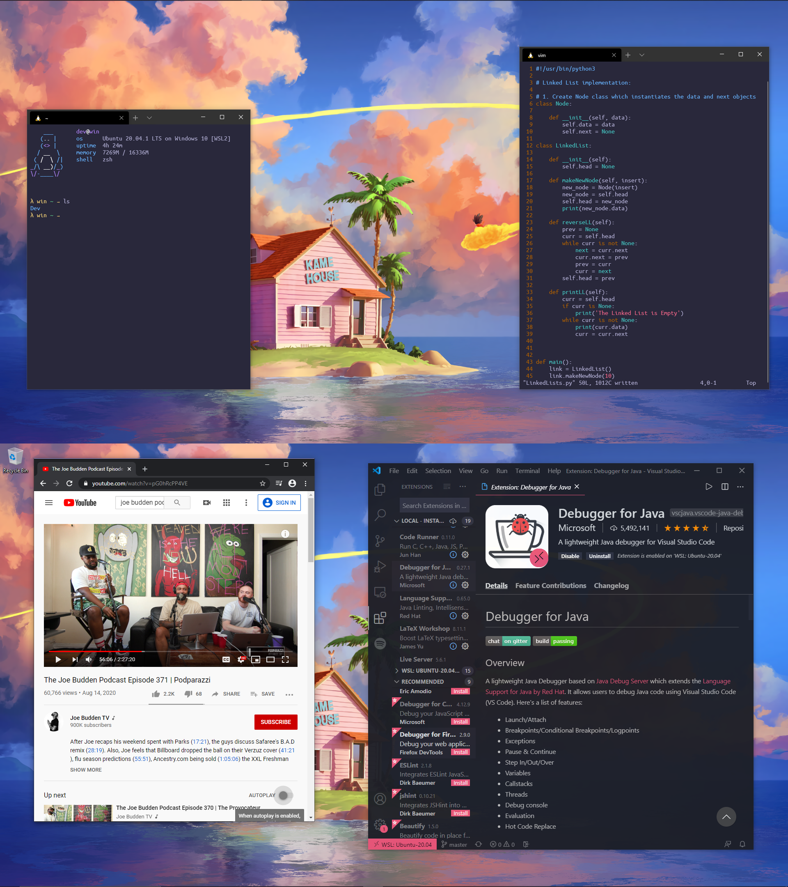

<h1 align="center"> 🖲️ WSL Dotfiles </h1>

## Preview

  

## System Overview

+ **OS**: Windows 10
+ **Subystem**: Ubuntu 20.4
+ **Shell**: ZSH
+ **ZSH theme**: norm
+ **Terminal**: WSL2
+ **Editor**: Vim / NeoVim / VSC
+ **Browser**: Google Chrome
+ **Start-Up Page**: [Jarvis](https://github.com/loej/Jarvis)
+ **Color Scheme**: [Banana Blueberry](https://atomcorp.github.io/themes)
+ **Wallpaper**: [Wallpaper Engine](https://store.steampowered.com/app/431960/Wallpaper_Engine/)

## Details
